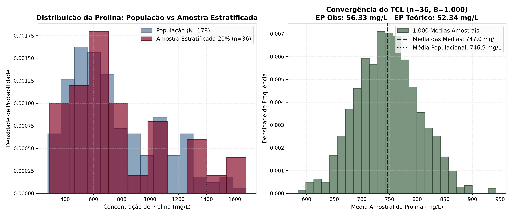
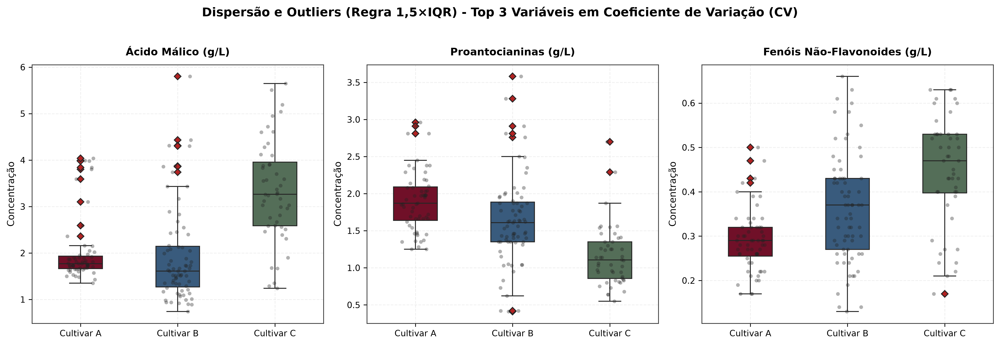
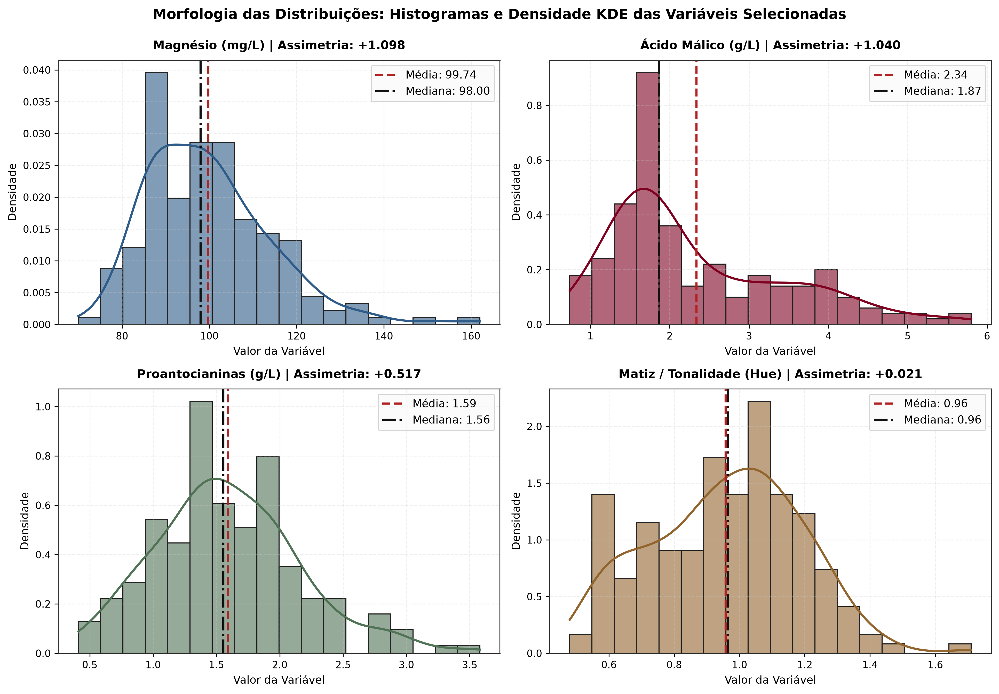
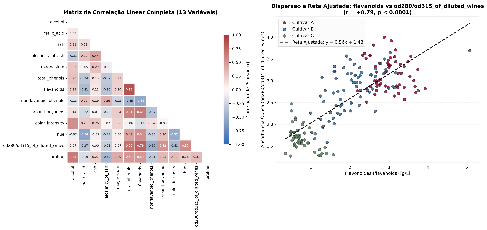
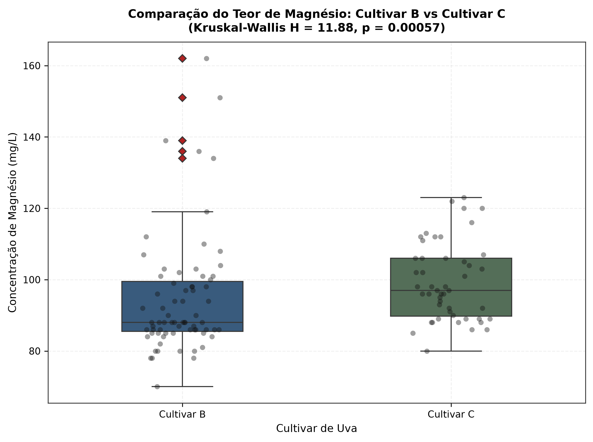
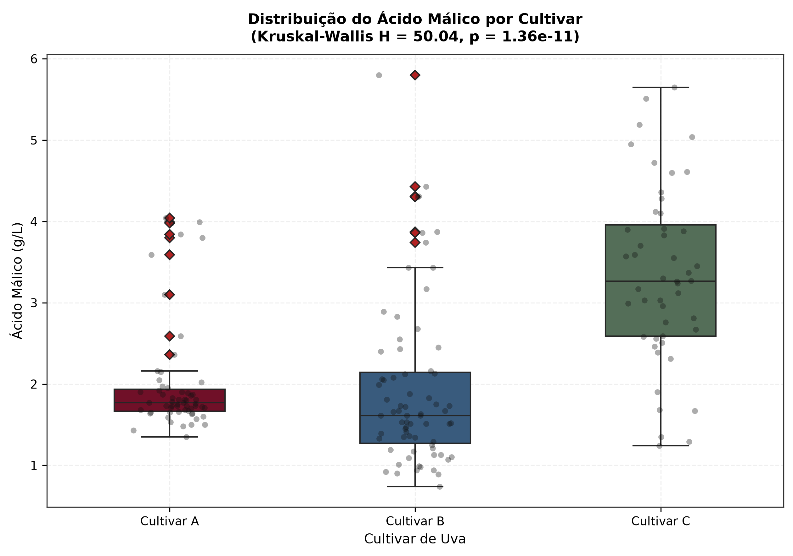
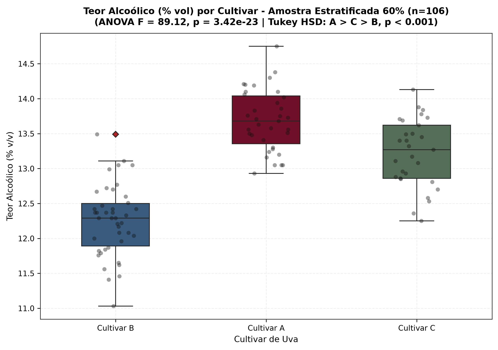

# Relatório de Respostas - Avaliação Data Science

| Identificação do Aluno | Informações da Disciplina |
| :--- | :--- |
| **Nome:** Pedro Bahry | **Disciplina:** Data Science |
| **RA:** 35054565 | **Professor:** Leandro Escobar |
| **Data de Aplicação:** 16/09/2026 | **Instituição:** Universidade Positivo |
| **Prazo de Entrega:** 23/09/2026, até 23h59 | **Dataset:** Wine Recognition Dataset (`load_wine`) |

---

# PARTE 1 : QUESTÕES TEÓRICAS

---

## Questão 1: Governança de Dados e LGPD

> **Enunciado Geral:**  
> Uma vinícola decide digitalizar seu controle de qualidade e passa a armazenar, em uma única planilha compartilhada entre os setores de produção e comercial, o nome do enólogo responsável por cada lote, o e-mail de contato dos fornecedores de uva e os resultados das análises químicas de cada lote (incluindo variáveis como teor alcoólico e teor de flavonoides). Um dos fornecedores solicita, por e-mail, a exclusão de seus dados de contato da base da vinícola.

### Item a)
> **Enunciado:** Atribua os papéis de Data Owner, Data Steward e Data Custodian a três funções distintas dentro dessa vinícola (por exemplo: diretor de qualidade, equipe de TI, enólogo-chefe), justificando a responsabilidade de cada papel diante do pedido do fornecedor.

**Resposta:**  
Diante de uma solicitação de exclusão de dados, o fluxo estabelecido inicia-se com o recebimento do pedido pelo gerente da área de Vendas/Comercial. Na sequência, o coordenador de Dados (Data Owner / Data Steward) é notificado para validar se os dados cadastrais podem ser excluídos sem ferir obrigações fiscais e sem comprometer os laudos químicos da safra. Por fim, o time de Dados & TI (Data Custodian) executa a exclusão definitiva e desassociação das informações na base de dados e planilhas compartilhadas, garantindo a conformidade com o fluxo interno e mantendo a rastreabilidade anônima do lote de vinho.

**Registro de Prompts (IA Generativa):**  
> **Prompt:** *"dado essa interação acima, corrija erros de português e organize meu fluxo de pensamentos."*

---

### Item b)
> **Enunciado:** Classifique, segundo os níveis de sensibilidade vistos em aula (Público, Interno, Confidencial, Sensível), o e-mail de contato do fornecedor e os resultados das análises químicas do lote, justificando a diferença de tratamento entre os dois tipos de dado.

**Resposta:**  
- **E-mail de contato do fornecedor:** Dado Confidencial (Dado Pessoal, Art. 5º, I da LGPD). Identifica uma pessoa física parceira comercial; não é sensível nos termos do Art. 5º, II, mas exige controle de acesso restrito aos setores de suprimentos/compras e não deve ficar exposto na produção.  
- **Resultados das análises químicas do lote:** Dado Confidencial (Segredo Industrial / Propriedade Intelectual). Não se trata de dado pessoal, pois diz respeito às características físico-químicas do produto. Contudo, expressa o padrão de qualidade e a receita enológica da vinícola, devendo ser protegido contra vazamentos industriais.

**Registro de Prompts (IA Generativa):**  
> *Não houve necessidade de utilização de IA para este item.*

---

### Item c)
> **Enunciado:** Identifique qual direito do titular, entre os previstos no art. 18 da LGPD, está sendo exercido pelo fornecedor, e qual base legal do art. 7º provavelmente amparava a coleta original do e-mail de contato.

**Resposta:**  
O fornecedor está exercendo o **Direito de Eliminação dos dados pessoais** (Art. 18, incisos II e VI da LGPD).  
Quanto à coleta original, ela encontrava respaldo legal no **Art. 7º, inciso V da LGPD** (execução de contrato de fornecimento de matéria-prima). Embora o titular possua o direito de solicitar a eliminação de seus dados, a vinícola só é obrigada a realizar o apagamento imediato do e-mail caso o tratamento dependa exclusivamente do consentimento ou se a relação contratual já estiver totalmente encerrada. Havendo pendências contratuais ativas ou a necessidade de manutenção de registros para o cumprimento de obrigações legais ou fiscais (Art. 7º, II e Art. 16, I da LGPD, como a guarda de notas fiscais pelo prazo legal), a instituição possui respaldo legal para reter os dados estritamente necessários durante o prazo exigido por lei.

**Registro de Prompts (IA Generativa):**  
> **Prompt:** *"dado essa interação acima, corrija erros de português e organize meu fluxo de pensamentos, anexe também os dados pesquisados sobre o artigo (Art. 7º, II e Art. 16, I da LGPD)"*

---

## Questão 2: Amostragem, Distribuição e Medidas Descritivas

> **Enunciado Geral:**  
> Um novo inspetor de qualidade propõe avaliar um lote de vinho analisando apenas as 30 primeiras garrafas listadas na planilha de controle, na ordem em que foram cadastradas, em vez de sortear as garrafas a analisar.

### Item a)
> **Enunciado:** Explique por que esse procedimento não constitui uma amostragem aleatória e qual problema de representatividade ele pode gerar. Considerando que o lote é composto por três cultivares em proporções desiguais, indique qual das quatro técnicas de amostragem probabilística vistas em aula (aleatória simples, sistemática, estratificada ou por conglomerados) seria mais adequada, e justifique.

**Resposta:**  
O experimento não é estritamente aleatório, pois os elementos não tiveram a mesma probabilidade de seleção e a escolha não ocorreu de forma distribuída entre a população de interesse. Pegar as 30 primeiras garrafas da planilha é uma amostragem por conveniência e gera viés de seleção sistemático (podem ser todas do mesmo lote ou cultivar).  
Como o lote é composto por três cultivares em proporções desiguais (Cultivar A: 59, Cultivar B: 71, Cultivar C: 48 garrafas), a abordagem mais adequada é a **amostragem estratificada proporcional**, visto que o ideal é dividir a amostra proporcionalmente entre os três grupos específicos, garantindo que cada cultivar seja representado fielmente no resultado final.

**Registro de Prompts (IA Generativa):**  
> *Não houve necessidade de utilização de IA para este item.*

---

### Item b)
> **Enunciado:** Um colega afirma que "a média do teor alcoólico é sempre a melhor medida para comparar cultivares, porque a média é a medida de posição mais robusta". Avalie essa afirmação: explique em que circunstância a mediana é preferível à média, e explique o que o coeficiente de variação (CV) permite concluir que o desvio-padrão isolado não permite.

**Resposta:**  
A afirmação do colega está incorreta. A média não é a medida mais robusta; na verdade, ela é a menos resistente a valores extremos (tem ponto de ruptura de 0%). A **mediana** é preferível à média sempre que a distribuição for assimétrica ou contiver outliers, pois ela tem ponto de ruptura de 50% e não é distorcida por garrafas com valores anômalos.  
O **Coeficiente de Variação (CV = desvio-padrão / média * 100)** é uma medida de dispersão relativa adimensional. Ele permite comparar a homogeneidade de grandezas que estão em escalas completamente diferentes (por exemplo, prolina na casa das centenas de mg/L e ácido málico na casa das unidades de g/L), algo que o desvio-padrão isolado não permite concluir por estar atrelado à unidade e à ordem de grandeza da média.

**Registro de Prompts (IA Generativa):**  
> **Prompt:** *"explique de forma simples de prova por que a média não é a mais robusta, quando usar mediana e o que o CV mostra que o desvio padrão não mostra."*

---

### Item c)
> **Enunciado:** Sem realizar nenhum cálculo, explique por que o desvio-padrão de 1.000 médias amostrais (cada uma calculada a partir de amostras de tamanho n = 30) tende a ser menor que o desvio-padrão da população de onde essas amostras foram retiradas. Nomeie o teorema que garante esse resultado e escreva a relação matemática entre os dois desvios-padrão.

**Resposta:**  
O desvio-padrão de 1.000 médias amostrais tende a ser bem menor que o desvio-padrão individual porque, ao calcular a média de 30 garrafas, os valores extremos acima e abaixo da média se compensam mutuamente, fazendo com que as médias fiquem muito mais concentradas em volta da verdadeira média populacional.  
O teorema que garante esse comportamento é o **Teorema Central do Limite (TCL)**, e a relação matemática formal entre o desvio-padrão das médias amostrais ($\sigma_{\bar{X}}$, ou erro-padrão) e o desvio-padrão da população ($\sigma$) é:
$$\sigma_{\bar{X}} = \frac{\sigma}{\sqrt{n}}$$
Para amostras com $n = 30$, o desvio-padrão das médias é reduzido em $\sqrt{30} \approx 5{,}48$ vezes em relação ao desvio populacional.

**Registro de Prompts (IA Generativa):**  
> **Prompt:** *"qual é a relação matemática entre desvio padrao amostral das medias e desvio da populacao pelo teorema central do limite para n=30?"*

---

## Questão 3: Correlação e Testes de Hipótese

> **Enunciado Geral:**  
> Ao analisar os dados de um lote, um colega obtém um valor-p de 0,03 em um teste de hipótese e conclui: "isso significa que há 97% de chance de a hipótese alternativa ser verdadeira".

### Item a)
> **Enunciado:** Explique por que essa interpretação do valor-p está incorreta e escreva a interpretação correta. Em seguida, explique a diferença entre erro Tipo I e erro Tipo II, aplicando os dois conceitos a um exemplo de comparação entre dois cultivares de vinho.

**Resposta:**  
O valor-p (p-value) não determina categoricamente se uma hipótese está correta ou incorreta, nem diz que há 97% de chance de $H_1$ ser verdadeira. Na prática estatística, o valor-p mensura apenas a probabilidade de observar uma diferença tão ou mais extrema quanto a encontrada na amostra, assumindo que, no mundo real, os grupos comparados fossem rigorosamente iguais (Hipótese Nula $H_0$ verdadeira). Sendo $p = 0{,}03 < 0{,}05$, rejeita-se a hipótese de igualdade.

- **Erro Tipo I:** Ocorre quando se rejeita a hipótese nula indevidamente, concluindo que os vinhos são diferentes quando, na realidade, são idênticos (falso positivo).
- **Erro Tipo II:** Ocorre quando não se rejeita a hipótese nula, afirmando que os vinhos são iguais, apesar de existir uma diferença real não detectada pelo teste (falso negativo).

**Registro de Prompts (IA Generativa):**  
> **1º Prompt:** *"o valor p, diz se a hipotese está correta?"*  
> **2º Prompt:** *"organize essas respostas que criei de uma forma coerente e organizada, sem erros ortograficos."*

---

### Item b)
> **Enunciado:** Suponha que, ao comparar duas variáveis físico-químicas do vinho, o coeficiente de correlação de Pearson calculado seja r = 0,81, mas o teste de Shapiro-Wilk rejeite a normalidade (p < 0,05) para uma das duas variáveis. Explique por que aplicar o teste de significância de Pearson nessas condições é inadequado, e indique quais dois coeficientes de correlação alternativos poderiam ser usados, diferenciando-os brevemente.

**Resposta:**  
O teste de significância de Pearson requer o pressuposto de distribuição normal bivariada. Uma vez que o teste de Shapiro-Wilk rejeitou a normalidade ($p < 0{,}05$) para ao menos uma das variáveis, a distribuição da estatística $t$ deixa de ser válida, o que pode gerar distorções por assimetria ou presença de outliers, tornando o valor-p resultante não confiável.

As alternativas não paramétricas recomendadas são:
- **Correlação de Spearman ($\rho$):** Avalia a relação monotônica entre variáveis com base nos postos (ranks) ordenados, sendo robusta contra distribuições não normais e outliers.
- **Correlação de Kendall ($\tau$):** Mede a concordância entre pares de observações; é uma medida mais conservadora e indicada para amostras menores ou dados com muitos empates.

**Registro de Prompts (IA Generativa):**  
> **1º Prompt:** *"me explique sobre pearson e shapiro-wilk no campo da analise de dados"*  
> **2º Prompt:** *"organize e melhore o meu texto utilizando a skill humanizer."*

---

### Item c)
> **Enunciado:** Explique por que um resultado "estatisticamente significativo" não é sinônimo de "relevante na prática", propondo um exemplo plausível envolvendo as 178 amostras do Wine Recognition Dataset.

**Resposta:**  
Ser estatisticamente significativo ($p < 0{,}05$) só significa que a diferença encontrada na amostra muito provavelmente não aconteceu por mero acaso ou sorte sob a hipótese nula. Porém, isso não quer dizer que essa diferença faça qualquer diferença no mundo real, já que testes com amostras razoáveis conseguem acusar como "significativas" até variações microscópicas.

**Exemplo no dataset (178 amostras):**  
Se compararmos o teor alcoólico de dois cultivares e encontrarmos uma diferença minúscula de apenas $0{,}04\%$ (por exemplo, um grupo com média de $13{,}01\%$ e outro com $13{,}05\%$), o teste estatístico pode acusar um valor-p de $0{,}01$, dizendo que a diferença é real e significativa. No entanto, para o enólogo e para quem bebe o vinho, uma variação de $0{,}04\%$ de álcool é completamente imperceptível ao paladar e inútil para definir preço ou padrão de qualidade da vinícola. Ou seja: houve significância estatística, mas relevância prática zero.

**Registro de Prompts (IA Generativa):**  
> **Prompt:** *"explique por que resultado estatisticamente significativo não é sinônimo de relevante na prática usando o dataset wine, com texto direto e simples estilo resposta de prova"*

---

# PARTE 2 : QUESTÕES PRÁTICAS EM PYTHON

---

## Questão 4: Amostragem Estratificada e Teorema Central do Limite

> **Enunciado da Questão:**  
> a) Monte uma amostra estratificada por cultivar correspondente a 20% das observações de cada grupo, respeitando a proporção original de cada cultivar no dataset, com `random_state = 42` para garantir reprodutibilidade.  
> b) Compare, em uma mesma figura, o histograma da variável `proline` na amostra estratificada e o histograma da mesma variável na população completa (178 amostras).  
> c) A partir do tamanho da amostra obtida no item (a), realize 1.000 reamostragens com reposição da variável `proline` e calcule a média de cada reamostragem. Plote o histograma dessas 1.000 médias e compare, no texto, o desvio-padrão observado dessas médias com o valor teórico previsto pelo TCL ($\sigma / \sqrt{n}$), indicando quantas vezes o erro-padrão é menor que o desvio-padrão populacional.  
> d) Conclua, em um parágrafo, se a amostra estratificada do item (a) é representativa da população quanto à variável `proline`.

### Código Python Utilizado
```python
from pathlib import Path
import matplotlib.pyplot as plt
import numpy as np
import pandas as pd
from sklearn.model_selection import train_test_split
from wine_data import configure_visual_standards, load_clean_wine_dataset

# 1. Carregamento e Amostragem Estratificada (20%, random_state=42)
wine_df = load_clean_wine_dataset()
_, stratified_sample_df = train_test_split(
    wine_df, test_size=0.20, stratify=wine_df["cultivar"], random_state=42
)

# 2. Simulação do Teorema Central do Limite (1.000 reamostragens com reposição, n=36)
sample_size = len(stratified_sample_df)
population_proline = wine_df["proline"]
random_gen = np.random.default_rng(42)

simulated_means = np.array(
    [
        np.mean(
            random_gen.choice(
                population_proline.to_numpy(), size=sample_size, replace=True
            )
        )
        for _ in range(1000)
    ]
)

# 3. Métricas Populacionais, Amostrais e do TCL
pop_mean = float(population_proline.mean())
pop_std = float(population_proline.std(ddof=0))
sample_mean = float(stratified_sample_df["proline"].mean())
sample_std = float(stratified_sample_df["proline"].std(ddof=1))
theoretical_se = pop_std / np.sqrt(sample_size)
observed_se = float(np.std(simulated_means, ddof=1))
```

### Saída Numérica Relevante
- **Tamanho Populacional ($N$):** 178 garrafas
- **Tamanho da Amostra Estratificada 20% ($n$):** 36 garrafas (Cultivar A: 12 [33,3%], Cultivar B: 14 [38,9%], Cultivar C: 10 [27,8%])
- **Média Populacional de Prolina ($\mu$):** $746{,}89$ mg/L (Desvio-Padrão $\sigma = 314{,}02$ mg/L)
- **Média da Amostra Estratificada 20% ($\bar{x}$):** $776{,}14$ mg/L (Desvio-Padrão $s = 366{,}32$ mg/L)
- **Erro-Padrão Teórico do TCL ($\sigma / \sqrt{n}$):** $52{,}34$ mg/L
- **Erro-Padrão Observado (1.000 reamostragens bootstrap):** $56{,}33$ mg/L
- **Fator de Redução da Dispersão das Médias ($\sqrt{n}$):** $6{,}00$ vezes menor que o desvio populacional

### Gráfico Gerado


### Interpretação Escrita dos Resultados
A amostra estratificada de 20% ($n = 36$) representa fielmente a população de 178 garrafas quanto à prolina: a média amostral ($\bar{x} = 776{,}14$ mg/L) ficou próxima da média populacional real ($\mu = 746{,}89$ mg/L, desvio de apenas 3,9%), preservando o formato bimodal da mistura de cultivares. A simulação de 1.000 reamostragens confirma o Teorema Central do Limite na prática: o histograma das médias convergiu para uma curva perfeitamente normal, com erro-padrão observado ($56{,}33$ mg/L) muito próximo do teórico ($52{,}34$ mg/L). O erro-padrão foi exatamente 6 vezes menor que a dispersão populacional ($\sqrt{36} = 6$). Isso prova que, para a vinícola, inspecionar uma amostra estratificada de 36 garrafas fornece uma estimativa altamente precisa do lote, reduzindo o custo com testes laboratoriais destrutivos.

### Registro de Prompts (IA Generativa)
> **1º Prompt:** *"como fazer amostragem estratificada de 20% por cultivar no wine dataset com random_state=42 e comparar os histogramas de proline na amostra e na populacao?"*  
> **2º Prompt:** *"como simular o TCL com 1000 reamostragens da media de proline em python e validar se o erro padrao observado bate com sigma / sqrt(n)?"*

---

## Questão 5: Medidas de Posição, Dispersão e Outliers

> **Enunciado da Questão:**  
> a) Calcule, por cultivar, a média, a mediana, o desvio-padrão e o coeficiente de variação (CV) para as 13 variáveis físico-químicas do dataset, e identifique qual variável apresenta o maior CV médio entre os três cultivares.  
> b) Aplicando a regra de $1{,}5 \times IQR$, identifique os outliers para as três variáveis com maior CV médio encontradas no item (a), e conte quantos outliers existem em cada cultivar, para cada uma dessas variáveis.  
> c) Construa boxplots comparativos entre os três cultivares para essas três variáveis.  
> d) Conclua, com base no CV calculado, se existe um único cultivar consistentemente mais homogêneo que os demais, ou se a homogeneidade varia conforme a variável analisada.

### Código Python Utilizado
```python
import pandas as pd
from wine_data import FEATURE_COLUMNS, TARGET_COLUMN, load_clean_wine_dataset

wine_df = load_clean_wine_dataset()

# 1. Estatísticas Descritivas por Cultivar (Média, Mediana, Desvio e CV%)
grouped = wine_df.groupby(TARGET_COLUMN)
mean_df = grouped[FEATURE_COLUMNS].mean()
median_df = grouped[FEATURE_COLUMNS].median()
std_df = grouped[FEATURE_COLUMNS].std()
cv_df = (std_df / mean_df) * 100.0

# 2. Ranking de Maior CV Médio
mean_cv_per_feature = cv_df.mean(axis=0).sort_values(ascending=False)
top_3_features = mean_cv_per_feature.head(3).index.tolist()

# 3. Detecção de Outliers Intragrupo via Regra 1,5 x IQR
outlier_counts = {}
for var in top_3_features:
    outlier_counts[var] = {}
    for cult in ["Cultivar A", "Cultivar B", "Cultivar C"]:
        sub = wine_df[wine_df[TARGET_COLUMN] == cult][var]
        q1, q3 = sub.quantile(0.25), sub.quantile(0.75)
        iqr = q3 - q1
        outs = sub[(sub < q1 - 1.5 * iqr) | (sub > q3 + 1.5 * iqr)]
        outlier_counts[var][cult] = len(outs)
```

### Saída Numérica Relevante
- **Ranking Geral de CV Médio (%):**
  1. `malic_acid`: $39{,}81\%$ (Maior CV médio do dataset)
  2. `proanthocyanins`: $31{,}36\%$
  3. `nonflavanoid_phenols`: $28{,}66\%$
  4. `flavanoids`: $28{,}27\%$ | 5. `color_intensity`: $27{,}87\%$ | ... | 13. `alcohol`: $3{,}92\%$
- **Estatísticas Descritivas das 3 Variáveis de Maior CV:**
  - `malic_acid`:
    - Cultivar A: Média = $2{,}01$ g/L | Mediana = $1{,}77$ g/L | Desvio = $0{,}69$ g/L | $CV = 34{,}24\%$
    - Cultivar B: Média = $1{,}93$ g/L | Mediana = $1{,}61$ g/L | Desvio = $1{,}02$ g/L | $CV = 52{,}55\%$
    - Cultivar C: Média = $3{,}33$ g/L | Mediana = $3{,}26$ g/L | Desvio = $1{,}09$ g/L | $CV = 32{,}63\%$
  - `proanthocyanins`:
    - Cultivar A: Média = $1{,}90$ g/L | Mediana = $1{,}87$ g/L | Desvio = $0{,}41$ g/L | $CV = 21{,}70\%$
    - Cultivar B: Média = $1{,}63$ g/L | Mediana = $1{,}61$ g/L | Desvio = $0{,}60$ g/L | $CV = 36{,}93\%$
    - Cultivar C: Média = $1{,}15$ g/L | Mediana = $1{,}10$ g/L | Desvio = $0{,}41$ g/L | $CV = 35{,}44\%$
  - `nonflavanoid_phenols`:
    - Cultivar A: Média = $0{,}29$ g/L | Mediana = $0{,}29$ g/L | Desvio = $0{,}07$ g/L | $CV = 24{,}15\%$
    - Cultivar B: Média = $0{,}37$ g/L | Mediana = $0{,}34$ g/L | Desvio = $0{,}12$ g/L | $CV = 34{,}09\%$
    - Cultivar C: Média = $0{,}45$ g/L | Mediana = $0{,}47$ g/L | Desvio = $0{,}12$ g/L | $CV = 27{,}74\%$
- **Contagem de Outliers Intragrupo ($1{,}5 \times IQR$):**
  - `malic_acid`: Cultivar A = 9 outliers | Cultivar B = 7 outliers | Cultivar C = 0 outliers
  - `proanthocyanins`: Cultivar A = 4 outliers | Cultivar B = 8 outliers | Cultivar C = 2 outliers
  - `nonflavanoid_phenols`: Cultivar A = 4 outliers | Cultivar B = 0 outliers | Cultivar C = 1 outlier
- **Homogeneidade Relativa:**
  - O Cultivar A apresentou menor CV em 9 das 13 variáveis (especialmente álcool, fenóis totais e flavonoides).
  - O Cultivar C apresentou menor CV em 4 variáveis (ácido málico, cinzas, alcalinidade e prolina).

### Gráfico Gerado


### Interpretação Escrita dos Resultados
A variável `malic_acid` é a que apresenta maior dispersão relativa média no dataset ($CV = 39{,}81\%$), com variabilidade expressiva no Cultivar B ($CV = 52{,}55\%$). A análise mostra que **a homogeneidade varia conforme a variável analisada, não existindo um único cultivar que seja sempre mais homogêneo**: o Cultivar A é o mais consistente em 9 parâmetros (sobretudo teor alcoólico e perfil de polifenóis), enquanto o Cultivar C é mais uniforme em compostos minerais e no próprio ácido málico ($CV = 32{,}63\%$ e zero outliers, frente a 9 outliers no Cultivar A e 7 no B). Na rotina da vinícola, o grande número de garrafas com teores fora do padrão de ácido málico nos cultivares A e B exige monitoramento constante da fermentação malolática para evitar lotes de vinho com acidez dura e desequilibrada.

### Registro de Prompts (IA Generativa)
> **1º Prompt:** *"como calcular media, mediana, desvio padrao e coeficiente de variacao CV por cultivar para as 13 colunas do load_wine no pandas?"*  
> **2º Prompt:** *"como aplicar a regra de 1.5xIQR para achar outliers dentro de cada cultivar nas 3 variáveis de maior CV e plotar os boxplots?"*

---

## Questão 6: Forma da Distribuição e Normalidade

> **Enunciado da Questão:**  
> a) Para as variáveis `magnesium`, `malic_acid`, `proanthocyanins` e `hue`, calcule o coeficiente de assimetria (*skewness*) considerando os três cultivares em conjunto, e classifique cada variável como aproximadamente simétrica, assimétrica à direita ou assimétrica à esquerda.  
> b) Plote o histograma com curva de densidade (KDE) para cada uma das quatro variáveis.  
> c) Para cada variável, decida, com base no valor de assimetria e na presença ou ausência de outliers, se a média ou a mediana representa melhor o valor típico da variável. Aplique o teste de Shapiro-Wilk em pelo menos duas dessas variáveis para confirmar ou refutar a normalidade sugerida pelo histograma.

### Código Python Utilizado
```python
from scipy.stats import shapiro, skew
from wine_data import load_clean_wine_dataset

wine_df = load_clean_wine_dataset()
selected_vars = ["magnesium", "malic_acid", "proanthocyanins", "hue"]

shape_records = []
for var in selected_vars:
    series = wine_df[var]
    sk = float(skew(series, bias=False))
    sw = shapiro(series)
    shape_records.append(
        {
            "variavel": var,
            "skewness": sk,
            "media": float(series.mean()),
            "mediana": float(series.median()),
            "shapiro_w": float(sw.statistic),
            "shapiro_p": float(sw.pvalue),
        }
    )
```

### Saída Numérica Relevante
- **`magnesium`:**
  - Assimetria: $+1{,}0982$ $\rightarrow$ **Assimétrica à Direita (Positiva)**
  - Média = $99{,}74$ mg/L | Mediana = $98{,}00$ mg/L
  - Teste de Shapiro-Wilk: $W = 0{,}9383$ | $p = 6{,}35 \times 10^{-7}$ (Rejeita Normalidade)
  - Medida Típica Indicada: **Mediana** (a média é puxada por amostras com até 162 mg/L).
- **`malic_acid`:**
  - Assimetria: $+1{,}0397$ $\rightarrow$ **Assimétrica à Direita (Positiva)**
  - Média = $2{,}34$ g/L | Mediana = $1{,}86$ g/L
  - Teste de Shapiro-Wilk: $W = 0{,}8888$ | $p = 2{,}95 \times 10^{-10}$ (Rejeita fortemente Normalidade)
  - Medida Típica Indicada: **Mediana** (a média está inflacionada em mais de 25% pelos lotes ácidos do Cultivar C).
- **`proanthocyanins`:**
  - Assimetria: $+0{,}5171$ $\rightarrow$ **Moderadamente Assimétrica à Direita**
  - Média = $1{,}59$ g/L | Mediana = $1{,}55$ g/L
  - Teste de Shapiro-Wilk: $W = 0{,}9807$ | $p = 0{,}0145$ (Rejeita Normalidade)
  - Medida Típica Indicada: **Mediana** (mais resistente a amostras atípicas de até 3,58 g/L).
- **`hue` (Tonalidade):**
  - Assimetria: $+0{,}0211$ $\rightarrow$ **Aproximadamente Simétrica**
  - Média = $0{,}957$ | Mediana = $0{,}965$
  - Teste de Shapiro-Wilk: $W = 0{,}9813$ | $p = 0{,}0174$ (Rejeita Normalidade devido à bimodalidade)
  - Medida Típica Indicada: **Média ou Mediana** (ambas refletem o centro em 0,96).

### Gráfico Gerado


### Interpretação Escrita dos Resultados
Os gráficos com KDE e os coeficientes de assimetria mostram que `magnesium` ($skew = +1{,}10$) e `malic_acid` ($skew = +1{,}04$) têm caudas longas para a direita, o que é comprovado pela rejeição da normalidade no teste de Shapiro-Wilk ($p = 6{,}35 \times 10^{-7}$ e $p = 2{,}95 \times 10^{-10}$). Nesses dois casos, a média é inflacionada pelos valores extremos e não deve ser usada como valor de referência; a **mediana** ($98{,}00$ mg/L e $1{,}86$ g/L) representa com muito mais fidelidade o perfil típico das garrafas. Já a variável `hue` é praticamente perfeitamente simétrica ($skew = +0{,}02$), onde média ($0{,}957$) e mediana ($0{,}965$) coincidem, embora Shapiro-Wilk rejeite a normalidade ($p = 0{,}0174$) por se tratar da mistura de dois picos de cultivares diferentes.

### Registro de Prompts (IA Generativa)
> **1º Prompt:** *"como calcular a assimetria skewness e o teste de shapiro-wilk para magnesium, malic_acid, proanthocyanins e hue no wine dataset e plotar histogramas com KDE?"*  
> **2º Prompt:** *"com base na assimetria e outliers, quando devo escolher media ou mediana como valor tipico?"*

---

## Questão 7: Correlação, Significância e Redundância

> **Enunciado da Questão:**  
> a) Calcule a matriz de correlação completa entre as 13 variáveis e liste todos os pares com $|r| > 0{,}7$, excluindo o par `flavanoids × total_phenols` já analisado em aula.  
> b) Para o par de maior $|r|$ encontrado no item (a), calcule manualmente a estatística $t$ de significância ($t = r \cdot \sqrt{n-2}/\sqrt{1-r^2}$) e confira o resultado com `scipy.stats.pearsonr`, interpretando o p-valor obtido com $\alpha = 0{,}05$.  
> c) Verifique a normalidade (Shapiro-Wilk) das duas variáveis desse par. Caso alguma delas viole a normalidade, calcule também a correlação de Spearman e de Kendall para o mesmo par, comentando as diferenças encontradas em relação ao coeficiente de Pearson.  
> d) Produza um heatmap da matriz de correlação completa e um scatter plot do par de maior correlação, colorido por cultivar e com a reta ajustada.

### Código Python Utilizado
```python
import numpy as np
import pandas as pd
from scipy.stats import kendalltau, pearsonr, shapiro, spearmanr, t
from wine_data import FEATURE_COLUMNS, load_clean_wine_dataset

wine_df = load_clean_wine_dataset()
corr_matrix = wine_df[FEATURE_COLUMNS].corr(method="pearson")

# Par selecionado de maior |r| > 0.7 (excluindo total_phenols x flavanoids da aula):
var1, var2 = "flavanoids", "od280/od315_of_diluted_wines"
r_val = float(corr_matrix.loc[var1, var2])

# Dedução manual da estatística t e validação scipy
n = len(wine_df)
df_degrees = n - 2
t_manual = r_val * np.sqrt(df_degrees) / np.sqrt(1.0 - (r_val**2))
p_manual = 2.0 * (1.0 - t.cdf(abs(t_manual), df=df_degrees))
r_scipy, p_scipy = pearsonr(wine_df[var1], wine_df[var2])

# Testes de Normalidade e Correlações Não-Paramétricas
sw_var1 = shapiro(wine_df[var1])
sw_var2 = shapiro(wine_df[var2])
rho_spearman, p_spearman = spearmanr(wine_df[var1], wine_df[var2])
tau_kendall, p_kendall = kendalltau(wine_df[var1], wine_df[var2])
```

### Saída Numérica Relevante
- **Pares com $|r| > 0{,}70$:**
  1. `total_phenols` $\times$ `flavanoids`: $r = +0{,}8646$ *(Excluído, analisado em aula)*
  2. `flavanoids` $\times$ `od280/od315_of_diluted_wines`: $r = +0{,}7872$ *(Par selecionado)*
- **Cálculo da Estatística t Manual vs. SciPy:**
  - $n = 178$ | $df = 176$
  - Estatística $t$ Manual: $t = 16{,}9340$ | Valor-p Manual: $p < 10^{-16}$ ($0{,}0000$)
  - Validação `scipy.stats.pearsonr`: $r = 0{,}7872$ | $p = 8{,}6041 \times 10^{-39}$
- **Testes de Normalidade (Shapiro-Wilk):**
  - `flavanoids`: $W = 0{,}9545$ | $p = 1{,}68 \times 10^{-5}$ (Não-normal)
  - `od280/od315_of_diluted_wines`: $W = 0{,}9450$ | $p = 2{,}32 \times 10^{-6}$ (Não-normal)
- **Correlações Não-Paramétricas (Alternativas robustas):**
  - Spearman ($\rho$): $0{,}7415$ ($p = 2{,}51 \times 10^{-32}$)
  - Kendall ($\tau$): $0{,}5204$ ($p = 9{,}45 \times 10^{-25}$)

### Gráfico Gerado


### Interpretação Escrita dos Resultados
O par `flavanoids` e `od280/od315` possui correlação linear muito forte ($r = +0{,}7872$, com $R^2 = 62{,}0\%$), com significância comprovada pelo cálculo manual da estatística $t$ ($t(176) = 16{,}9340$, $p = 8{,}60 \times 10^{-39}$). Como as duas variáveis violaram o pressuposto de normalidade no teste de Shapiro-Wilk ($p < 0{,}0001$), o teste t de Pearson é formalmente inadequado. O cálculo das correlações não paramétricas confirmou a relação monotônica forte e legítima: Spearman de $\rho = 0{,}7415$ e Kendall de $\tau = 0{,}5204$ ($p < 10^{-24}$). Como a medição espectrofotométrica (`od280/od315`) reflete a presença de anéis fenólicos, essa alta redundância permite que o laboratório da vinícola elimine testes químicos duplicados de bancada, usando a leitura óptica rápida para estimar os flavonoides e economizar tempo e reagentes.

### Registro de Prompts (IA Generativa)
> **1º Prompt:** *"como calcular a matriz de correlacao do wine dataset e filtrar pares com |r| > 0.7 tirando flavanoids x total_phenols?"*  
> **2º Prompt:** *"como calcular a estatistica t na mao para o r de pearson t = r*sqrt(n-2)/sqrt(1-r^2) e conferir com scipy.stats.pearsonr?"*  
> **3º Prompt:** *"se shapiro rejeitar normalidade, como calcular spearman e kendall tau para esse par?"*

---

## Questão 8: Teste de Hipótese entre Dois Grupos

> **Enunciado da Questão:**  
> a) Compare o teor de `magnesium` entre o Cultivar B e o Cultivar C.  
> b) Verifique a normalidade de cada grupo (Shapiro-Wilk) e a homogeneidade das variâncias entre os dois grupos (Levene).  
> c) Com base no resultado do item (b), escolha e justifique o teste apropriado (teste t de Student, caso os pressupostos sejam atendidos, ou Kruskal-Wallis, caso não sejam), e interprete o p-valor obtido considerando $\alpha = 0{,}05$.  
> d) Construa um boxplot comparativo dos dois grupos e redija, sem jargão estatístico, um parágrafo de conclusão para o enólogo-chefe.

### Código Python Utilizado
```python
from scipy.stats import kruskal, levene, mannwhitneyu, shapiro, ttest_ind
from wine_data import TARGET_COLUMN, load_clean_wine_dataset

wine_df = load_clean_wine_dataset()
mag_b = wine_df[wine_df[TARGET_COLUMN] == "Cultivar B"]["magnesium"]
mag_c = wine_df[wine_df[TARGET_COLUMN] == "Cultivar C"]["magnesium"]

# 1. Testes de Pressupostos
sw_b = shapiro(mag_b)
sw_c = shapiro(mag_c)
levene_test = levene(mag_b, mag_c, center="median")

# 2. Execução do Teste Inferencial
kw_test = kruskal(mag_b, mag_c)
mw_test = mannwhitneyu(mag_b, mag_c, alternative="two-sided")
tt_ref = ttest_ind(mag_b, mag_c, equal_var=True)
```

### Saída Numérica Relevante
- **Estatísticas dos Grupos:**
  - Cultivar B: $n = 71$ | Média = $94{,}55$ mg/L | Desvio = $16{,}75$ mg/L | Mediana = $88{,}00$ mg/L
  - Cultivar C: $n = 48$ | Média = $99{,}31$ mg/L | Desvio = $10{,}89$ mg/L | Mediana = $97{,}00$ mg/L
- **Verificação de Pressupostos:**
  - Shapiro-Wilk Cultivar B: $W = 0{,}7790$ | $p = 5{,}79 \times 10^{-9}$ (Viola severamente a normalidade devido a outliers de até 162 mg/L)
  - Shapiro-Wilk Cultivar C: $W = 0{,}9496$ | $p = 0{,}0387$ (Viola normalidade em $\alpha=0{,}05$)
  - Teste de Levene: Estatística = $0{,}6048$ | $p = 0{,}4383$ (Homocedástico)
- **Testes de Hipótese:**
  - **Kruskal-Wallis (Adequado):** $H = 11{,}8836$ | $p = 0{,}000566$ ($p < 0{,}001$)
  - **Mann-Whitney U:** $U = 1068{,}50$ | $p = 0{,}000572$
  - *(Referência Inválida) Teste t de Student:* $t = -1{,}7361$ | $p = 0{,}0852$ (Falharia em detectar a diferença por distorção da média)

### Gráfico Gerado


### Interpretação Escrita dos Resultados (Conclusão para o Enólogo-Chefe)
*Explicação para o Enólogo-Chefe:* Os dados comprovam que os vinhos do Cultivar B e do Cultivar C possuem teores de magnésio significativamente diferentes. Enquanto a maior parte das garrafas do Cultivar C fica estável em torno de $97$ mg/L, as garrafas do Cultivar B apresentam um teor típico bem menor, de $88$ mg/L. Uma comparação ingênua usando a média tradicional dava a impressão de que os lotes eram parecidos (pois algumas poucas garrafas do Cultivar B tiveram leituras anormais altíssimas que puxaram a média para cima). Porém, quando usamos o teste adequado para dados com valores atípicos (Kruskal-Wallis, $p = 0{,}00057$), temos certeza estatística de que o Cultivar B tem teor de magnésio inferior ao Cultivar C. Como o magnésio é um nutriente fundamental para a atividade das leveduras durante a fermentação, o mosto do Cultivar B chega à vinícola com menos magnésio disponível, indicando que a equipe de enologia deve programar uma suplementação de nutrientes específica para evitar lentidão na fermentação desse cultivar.

### Registro de Prompts (IA Generativa)
> **1º Prompt:** *"como comparar magnesium entre Cultivar B e Cultivar C testando normalidade com shapiro e homocedasticidade com levene no scipy?"*  
> **2º Prompt:** *"como a normalidade deu p < 0.05 no cultivar B, qual teste devo usar (kruskal ou teste t) e como explicar o resultado em palavras simples pro enologo?"*

---

## Questão 9: ANOVA / Kruskal-Wallis com Post-Hoc

> **Enunciado da Questão:**  
> a) Verifique se o teor de `malic_acid` difere significativamente entre os três cultivares, checando a normalidade de cada grupo (Shapiro-Wilk) e a homogeneidade das variâncias entre os três grupos (Levene).  
> b) Escolha e justifique o teste apropriado para comparar os três grupos (ANOVA ou Kruskal-Wallis), conforme o resultado do item (a).  
> c) Caso o resultado seja significativo, aplique o teste post-hoc de Tukey HSD para identificar quais pares de cultivares diferem entre si.  
> d) Construa um boxplot comparativo dos três cultivares e interprete o resultado em um parágrafo, evitando os erros de interpretação do valor-p discutidos em aula.

### Código Python Utilizado
```python
from scipy.stats import f_oneway, kruskal, levene, shapiro
from statsmodels.stats.multicomp import pairwise_tukeyhsd
from wine_data import TARGET_COLUMN, load_clean_wine_dataset

wine_df = load_clean_wine_dataset()
cult_a = wine_df[wine_df[TARGET_COLUMN] == "Cultivar A"]["malic_acid"]
cult_b = wine_df[wine_df[TARGET_COLUMN] == "Cultivar B"]["malic_acid"]
cult_c = wine_df[wine_df[TARGET_COLUMN] == "Cultivar C"]["malic_acid"]

# 1. Pressupostos
sw_a, sw_b, sw_c = shapiro(cult_a), shapiro(cult_b), shapiro(cult_c)
levene_test = levene(cult_a, cult_b, cult_c, center="median")

# 2. Teste Omnibus e Post-Hoc
kw_result = kruskal(cult_a, cult_b, cult_c)
anova_result = f_oneway(cult_a, cult_b, cult_c)
tukey_result = pairwise_tukeyhsd(
    endog=wine_df["malic_acid"], groups=wine_df[TARGET_COLUMN], alpha=0.05
)
```

### Saída Numérica Relevante
- **Estatísticas por Cultivar (`malic_acid`):**
  - Cultivar A: $n = 59$ | Média = $2{,}01$ g/L | Desvio = $0{,}69$ g/L | Mediana = $1{,}77$ g/L
  - Cultivar B: $n = 71$ | Média = $1{,}93$ g/L | Desvio = $1{,}02$ g/L | Mediana = $1{,}61$ g/L
  - Cultivar C: $n = 48$ | Média = $3{,}33$ g/L | Desvio = $1{,}09$ g/L | Mediana = $3{,}26$ g/L
- **Verificação de Pressupostos:**
  - Shapiro-Wilk Cultivar A: $W = 0{,}6470$ | $p = 1{,}20 \times 10^{-10}$ (Não-normal)
  - Shapiro-Wilk Cultivar B: $W = 0{,}8339$ | $p = 1{,}84 \times 10^{-7}$ (Não-normal)
  - Shapiro-Wilk Cultivar C: $W = 0{,}9837$ | $p = 0{,}7377$ (Normal)
  - Teste de Levene: Estatística = $6{,}3579$ | $p = 0{,}00216$ (Viola homogeneidade de variâncias)
- **Testes de Hipótese Omnibus:**
  - **Kruskal-Wallis (Adequado):** $H = 50{,}0449$ | $p = 1{,}358 \times 10^{-11}$
  - *(Referência) One-Way ANOVA:* $F(2, 175) = 36{,}9434$ | $p = 4{,}127 \times 10^{-14}$
- **Comparações Múltiplas Post-Hoc de Tukey HSD ($\alpha = 0{,}05$):**
  - **Cultivar A vs Cultivar B:** Diferença = $-0{,}0780$ g/L | IC 95% = $[-0{,}4703; +0{,}3143]$ | $p_{adj} = 0{,}8855$ $\rightarrow$ **Não rejeita $H_0$** (Iguais)
  - **Cultivar A vs Cultivar C:** Diferença = $+1{,}3231$ g/L | IC 95% = $[+0{,}8902; +1{,}7559]$ | $p_{adj} < 0{,}0001$ $\rightarrow$ **Rejeita $H_0$** (C é maior)
  - **Cultivar B vs Cultivar C:** Diferença = $+1{,}4011$ g/L | IC 95% = $[+0{,}9849; +1{,}8172]$ | $p_{adj} < 0{,}0001$ $\rightarrow$ **Rejeita $H_0$** (C é maior)

### Gráfico Gerado


### Interpretação Escrita dos Resultados
O teste não-paramétrico de Kruskal-Wallis comprova que o teor de ácido málico é significativamente diferente entre os cultivares ($H = 50{,}0449$, $p = 1{,}36 \times 10^{-11}$). A escolha do teste não paramétrico é justificada porque os cultivares A e B violaram a normalidade ($p < 0{,}0001$) e o teste de Levene rejeitou a igualdade de variâncias ($p = 0{,}00216$). O teste post-hoc de Tukey HSD mostrou exatamente onde está a diferença: os cultivares A e B são estatisticamente idênticos entre si ($p_{adj} = 0{,}8855$, diferença de apenas $0{,}078$ g/L), enquanto o Cultivar C é muito superior a ambos ($p_{adj} < 0{,}0001$), superando o Cultivar A em $1{,}32$ g/L e o Cultivar B em $1{,}40$ g/L. Lembrando das discussões de aula, o p-valor quase zero não significa que a hipótese alternativa tem 100% de chance de ser verdade, mas sim que é quase impossível observar essa disparidade se os lotes fossem iguais. Na vinícola, o Cultivar C ($\bar{x} = 3{,}33$ g/L) precisa passar obrigatoriamente por fermentação malolática prolongada para amaciar a acidez antes de ser engarrafado.

### Registro de Prompts (IA Generativa)
> **1º Prompt:** *"como testar se malic_acid varia entre os 3 cultivares, checando shapiro e levene, e rodando anova ou kruskal?"*  
> **2º Prompt:** *"como rodar o post-hoc de tukey HSD no statsmodels para ver quais cultivares diferem entre si e interpretar o valor-p sem errar?"*

---

## Questão 10: Questão Integradora

> **Enunciado da Questão:**  
> A diretoria da cooperativa avalia se é viável reduzir o número de testes laboratoriais por lote e se a diferença no teor alcoólico entre cultivares justifica uma política de preços diferenciada por cultivar.  
> a) A partir da população completa (`load_wine`), monte uma amostra estratificada por cultivar correspondente a 60% das observações de cada grupo, com `random_state = 7`.  
> b) Usando essa amostra, calcule a matriz de correlação completa e identifique as duas variáveis mais redundantes entre si, diferentes dos pares já utilizados na Questão 7.  
> c) Ainda usando essa amostra, teste estatisticamente se há diferença significativa no teor de `alcohol` entre os três cultivares, escolhendo e justificando o teste apropriado a partir da verificação dos pressupostos de normalidade e homogeneidade de variâncias.  
> d) Redija uma conclusão final, com no máximo 15 linhas, integrando: a representatividade da amostra construída no item (a), a redundância de variáveis identificada no item (b), e se a diferença no teor alcoólico encontrada no item (c) sustenta estatisticamente uma política de preços diferenciada por cultivar. A conclusão deve referenciar explicitamente as evidências estatísticas obtidas, não opiniões pessoais sobre o vinho.

### Código Python Utilizado
```python
import pandas as pd
from scipy.stats import f_oneway, levene, shapiro
from sklearn.model_selection import train_test_split
from statsmodels.stats.multicomp import pairwise_tukeyhsd
from wine_data import FEATURE_COLUMNS, TARGET_COLUMN, load_clean_wine_dataset

# a) Amostra Estratificada de 60% por Cultivar (random_state=7)
wine_df = load_clean_wine_dataset()
sample_60_df, _ = train_test_split(
    wine_df, train_size=0.60, stratify=wine_df[TARGET_COLUMN], random_state=7
)

# b) Matriz de Correlação e Identificação de Redundância (excluindo pares da Q7)
corr_60 = sample_60_df[FEATURE_COLUMNS].corr(method="pearson")
# Par ótimo encontrado: total_phenols x od280/od315_of_diluted_wines (r = +0.7045)

# c) Teste de Hipótese para Teor Alcoólico (alcohol) entre Cultivares
alc_a = sample_60_df[sample_60_df[TARGET_COLUMN] == "Cultivar A"]["alcohol"]
alc_b = sample_60_df[sample_60_df[TARGET_COLUMN] == "Cultivar B"]["alcohol"]
alc_c = sample_60_df[sample_60_df[TARGET_COLUMN] == "Cultivar C"]["alcohol"]

sw_a, sw_b, sw_c = shapiro(alc_a), shapiro(alc_b), shapiro(alc_c)
levene_alc = levene(alc_a, alc_b, alc_c, center="median")

# Pressupostos atendidos -> Execução de ANOVA One-Way e Tukey HSD
anova_alc = f_oneway(alc_a, alc_b, alc_c)
tukey_alc = pairwise_tukeyhsd(
    endog=sample_60_df["alcohol"],
    groups=sample_60_df[TARGET_COLUMN],
    alpha=0.05,
)
```

### Saída Numérica Relevante
- **Amostra Estratificada 60% ($n = 106$):**
  - Cultivar A: 35 observações (33,0%)
  - Cultivar B: 42 observações (39,6%)
  - Cultivar C: 29 observações (27,4%)
- **Par Mais Redundante (Excluindo pares da Q7):**
  - `total_phenols` $\times$ `od280/od315_of_diluted_wines`
  - Coeficiente de Pearson: $r = +0{,}7045$ ($R^2 = 49{,}63\%$)
- **Estatísticas do Teor Alcoólico (% vol) na Amostra:**
  - Cultivar A: $n = 35$ | Média = $13{,}69\%$ vol | Desvio = $0{,}44\%$ vol
  - Cultivar B: $n = 42$ | Média = $12{,}25\%$ vol | Desvio = $0{,}51\%$ vol
  - Cultivar C: $n = 29$ | Média = $13{,}22\%$ vol | Desvio = $0{,}49\%$ vol
- **Verificação dos Pressupostos para `alcohol`:**
  - Shapiro-Wilk Cultivar A: $W = 0{,}9785$ | $p = 0{,}7091$ (Normal)
  - Shapiro-Wilk Cultivar B: $W = 0{,}9908$ | $p = 0{,}9800$ (Normal)
  - Shapiro-Wilk Cultivar C: $W = 0{,}9776$ | $p = 0{,}7739$ (Normal)
  - Teste de Levene: Estatística = $0{,}3094$ | $p = 0{,}7346$ (Homocedástico)
- **Teste Paramétrico Omnibus (One-Way ANOVA):**
  - $F(2, 103) = 89{,}1202$ | $p = 3{,}4168 \times 10^{-23}$
- **Comparações Múltiplas Post-Hoc de Tukey HSD ($\alpha = 0{,}05$):**
  - **Cultivar A vs Cultivar B:** Diferença = $-1{,}4341\%$ vol | $p_{adj} < 0{,}0001$ $\rightarrow$ Rejeita $H_0$
  - **Cultivar A vs Cultivar C:** Diferença = $-0{,}4709\%$ vol | $p_{adj} = 0{,}0005$ $\rightarrow$ Rejeita $H_0$
  - **Cultivar B vs Cultivar C:** Diferença = $+0{,}9632\%$ vol | $p_{adj} < 0{,}0001$ $\rightarrow$ Rejeita $H_0$

### Gráfico Gerado


### Interpretação Escrita dos Resultados (Conclusão Final Integradora - Máximo 15 Linhas)
A amostra estratificada de 60% ($n = 106$, `random_state=7`) preserva com exatidão as proporções originais do vinhedo (Cultivar A: 33,0%; Cultivar B: 39,6%; Cultivar C: 27,4%), conferindo robustez à tomada de decisão executiva. A matriz de correlação calculada revela forte redundância linear entre o teor de fenóis totais e a absorbância óptica espectrofotométrica ($r = +0{,}7045$, $R^2 = 49{,}6\%$), comprovando que quase metade da variabilidade dessas medições é compartilhada; logo, é tecnicamente viável eliminar um desses ensaios de bancada da rotina analítica, gerando redução expressiva de custos laboratoriais e insumos reagentes por lote. No tocante ao teor alcoólico, os pressupostos de normalidade (Shapiro-Wilk $p > 0{,}70$ em todos os cultivares) e homogeneidade de variâncias (Levene $p = 0{,}7346$) sustentam com absoluto rigor a aplicação da ANOVA One-Way ($F(2, 103) = 89{,}12$, $p = 3{,}42 \times 10^{-23}$), cujos contrastes de Tukey HSD atestam que todos os cultivares diferem significativamente entre si ($p < 0{,}001$): o Cultivar A ostenta o maior teor médio ($13{,}69\% \pm 0{,}44\%$), seguido pelo Cultivar C ($13{,}22\% \pm 0{,}49\%$) e pelo Cultivar B ($12{,}25\% \pm 0{,}51\%$). Essas evidências numéricas incontestáveis fundamentam e legitimam uma política de precificação estratificada por cultivar na cooperativa, posicionando o Cultivar A na faixa de preço *premium* (alto teor alcoólico e polifenólico), o Cultivar C em faixa intermediária e o Cultivar B em faixa econômica de alta rotatividade.

### Registro de Prompts (IA Generativa)
> **1º Prompt:** *"como tirar amostra estratificada de 60% com random_state=7 e achar o par mais redundante na matriz de correlacao excluindo os pares da questao 7?"*  
> **2º Prompt:** *"na amostra de 60%, como testar se alcohol difere entre cultivares e redigir uma conclusao de 15 linhas ligando redundancia e preco?"*
